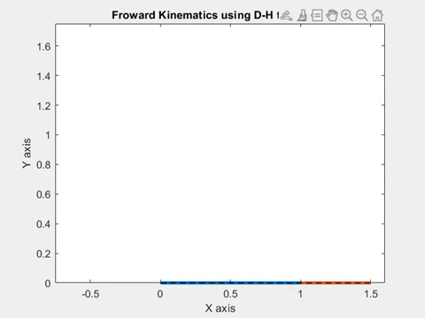

# Gaurav Joshi

  
   
  <samp>
    
 
     I am a Mechanical Engineer with a Bachelor's degree from Sant Longowal Institute of Engineering and Technology (SLIET). I have practical experience in various facets of mechanical engineering, including project management, design optimization, and quality assurance. My work at Mahindra & Mahindra Ltd. as an Assistant Manager involved driving process improvements and new product introductions. I am interested in research related to sustainable materials and the mechanical behavior of materials influenced by environmental and manufacturing factors. 
      

  </samp>

View my Resume here!

# Research Overview

 
Our research focuses on understanding human interaction through various means such as body movements, facial expressions, hand gestures, motion, speech, and thoughts. We are developing computational models to sense changes in human behavior. Our goal is to leverage Deep Learning and Computer Vision on a higher level to understand physiological representations of human behavior at neural, physical, and world levels. The relevance of our research lies in its potential applications in engineering intelligent products in the realm of human health.
  

# Awards & Honors
* Award 1
* Award 2
* Award 3

# Publications

 
Our research focuses on 
  

  
# Projects
  <table border="0">
  <tr>
    <td valign="top"></td>
    <td valign="top">

## Kinematic Simulation of a 2R Planar Robotic Arm: MATLAB Implementation with Denavit-Hartenberg Transformation

  
<b>Project Description</b>

This project explores the simulation of forward kinematics for a 2R planar robotic arm using MATLAB, integrating the Denavit-Hartenberg (D-H) Transformation method. The D-H method employs a recursive approach to calculate the rotation matrix and displacement vector of the end-effector relative to the base frame. Key steps involve assigning frames according to D-H rules, filling out the D-H parameter table, and incorporating parameters into the homogeneous transformation matrix. Adhering to D-H frame assignment rules ensures accurate representation of the manipulator's kinematic diagram. By modifying the D-H parameter table for 2D planar manipulation, the project emphasizes the practical application of the D-H method. Through MATLAB implementation, including loop-based variable analysis and plot generation, the project showcases the efficacy of the D-H method in accurately determining end effector positions. Additionally, the study highlights the importance of understanding manipulator kinematics in advancing automation across industries.

    </td>
  </tr>
</table>

 <table border="0">
  <tr>
    <td valign="top"></td>
    <td valign="top">

## Project Title
(Add your project title here.)

### Project Description
(Add your project description here.)

### Technologies Used
(Add the technologies used in your project here.)

### How to Run
(Add instructions on how to run your project here.)

    </td>
  </tr>
</table>

 <table border="0">
  <tr>
    <td valign="top"></td>
    <td valign="top">

## Project Title
(Add your project title here.)

### Project Description
(Add your project description here.)

### Technologies Used
(Add the technologies used in your project here.)

### How to Run
(Add instructions on how to run your project here.)

    </td>
  </tr>
</table>

